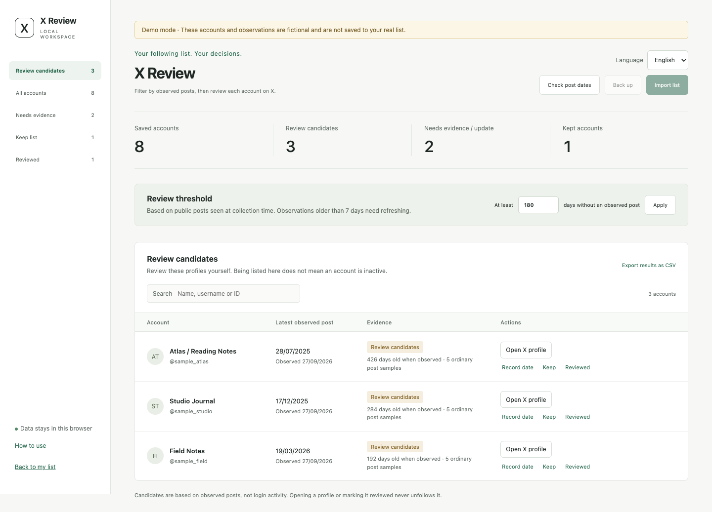

# X Review

X Review is a free, local browser extension for reviewing the accounts you follow on X. Collect a following list, record public post dates, and filter accounts that may warrant a closer look. Open each candidate on X to decide whether to unfollow it yourself. The extension never follows or unfollows accounts.

The interface supports English and Simplified Chinese, with a saved language preference. There is no build step, server, subscription, API key, or external JavaScript dependency.



## Install

Use Chrome 116 or later, or an Edge release based on Chromium 116 or later. Installation is through the browser's unpacked-extension feature.

1. Download and extract the ZIP from the [latest release](https://github.com/LiruiYu33/x-review/releases/latest). Alternatively, use **Code → Download ZIP** on this repository, or clone it.
2. Keep the extracted folder in a permanent location. Find the folder that directly contains `manifest.json`.
3. Open `chrome://extensions` in Chrome, or `edge://extensions` in Edge. Enable **Developer mode**, choose **Load unpacked**, and select that folder.
4. Pin X Review from the browser's extensions menu. Open its popup, then open the review workspace.

Do not delete or move the loaded folder. To update an existing installation, first export a JSON backup, replace the files in the same folder, click **Reload** on the extension management page, and refresh any open X pages. Uninstalling the extension can remove its local data. Reloading does not start a collection or profile check automatically.

## Choose a language

Use the language selector in the popup, review workspace, or activity-check page to select **English** or **Simplified Chinese**. The choice is saved locally and used when you reopen the extension. It changes the extension interface; account names and stored records are not rewritten, and X's own interface is not translated. The standalone webpage has its own saved preference because its storage is separate from the extension's.

## Review your following list

### 1. Collect or import accounts

Open your own Following page at `https://x.com/YOUR_HANDLE/following` and wait for the list to load. Open the extension, check the displayed owner, confirm that this is your own following list, and start automatic collection. X Review scrolls the page, saves the accounts it can read, and merges duplicates. Closing the popup does not stop collection. Hiding the X tab pauses it; returning to the tab resumes it. You can stop at any time and keep the records already saved.

Each scroll waits approximately 2.5 seconds. Collection stops after approximately 20 seconds without new accounts at the bottom, or after 20 minutes, 500 scrolls, or 10,000 accounts. These limits do not prove that the list is complete. Failed loading, hidden entries, or changes to X's page can leave gaps. A completed collection can also remove old local records; read [Automatic local cleanup](#automatic-local-cleanup) before starting.

You can instead import `data/following.js` from your [X account archive](https://help.x.com/en/managing-your-account/accessing-your-x-data), a JSON backup, a CSV file, or one handle or profile URL per line. Select only `following.js`, not the full archive ZIP. The file is parsed as data and is never executed. Manual page capture is also available: read the currently loaded list, review the preview, confirm ownership, and save it. Imports and manual captures merge records without triggering automatic cleanup.

### 2. Record public post dates

Open the activity-check page from the popup or review workspace. Choose whether to fill missing or stale observations, or recheck all pending accounts, then start the check. The browser asks for optional access to `https://x.com/*`. Granting access enables the requested run; it does not schedule future runs. Accounts marked to keep or already reviewed are skipped.

Checks visit profiles sequentially in one new X tab. Each profile waits at least 5 seconds for stable content, with a maximum of 25 seconds, followed by a fixed 3-second interval. A run can cover up to 5,000 accounts. Keep both the control page and its X tab open, and do not navigate the check tab yourself. Closing the popup is fine; closing or refreshing the control page, or closing the check tab, stops the run. A login, verification, rate-limit, or page-error prompt stops the check. Resolve the issue on X before explicitly starting again.

For a manual observation, open an account's profile from the workspace, select its Posts tab, return to the top, and wait for posts to load. Use the popup to read the page and save the observation after checking its preview. You can also enter a date you have verified yourself. For records that contain only a numeric ID, a redirect to a handle is an inferred association, not verified identity; check the destination carefully. The manual capture flow asks for confirmation before linking an ID record to a handle.

### 3. Filter and decide on X

The default threshold is 180 days. The comparison uses the interval between the observation date and the latest observed post, rather than allowing an old snapshot to become a candidate as time passes. Observations older than seven days require another check. Missing dates, protected profiles, unreadable pages, insufficient samples, and uncertain repost dates remain unknown rather than becoming inactivity candidates. A newer known pinned post can rule out a candidate; an old pinned post alone cannot establish inactivity.

Review each candidate by opening its profile on X. If you decide to unfollow, use X's native controls yourself. Afterwards, mark the record as reviewed or add it to your keep list. These are local labels and do not verify or change the actual follow relationship. Public posting history cannot establish whether someone still logs in, reads posts, or uses X privately.

## Automatic local cleanup

After manually unfollowing accounts on X, run a new collection of your own Following page. When a non-empty collection starts at the top and naturally reaches a stable bottom, X Review automatically removes eligible old local records that were absent from that run. There is no second selection or deletion-confirmation step. This changes the local review list only.

Manual stops, failed loads, navigation changes, empty collections, and collection limits do not trigger cleanup. Numeric-ID records, kept accounts, accounts known to belong to another owner's list, and records added or changed during the run are retained. Older imported records with no owner information are treated as belonging to the own-list collection you confirmed. Existing scans from version 1.3 or earlier do not trigger retrospective cleanup.

Reaching the bottom does not guarantee that X loaded every account, so an omitted account can be removed locally by mistake. Open the synchronisation history to inspect the result and undo the last effective cleanup. Undo restores missing records without overwriting newer versions you have reimported. A later run that removes nothing preserves the previous useful undo. Clearing the local list also clears the undo copy. Importing an old archive or backup may add removed accounts again.

## Imports, backups, and standalone use

A minimal CSV looks like this. Names and dates below are examples only; replace them with observations you have actually verified.

```csv
handle,name,latestPostAt,observedAt
example_user,Example account,2025-12-01T10:30:00+11:00,2026-09-27T10:00:00+10:00
another_user,Not yet checked,,
```

Use ISO 8601 dates with `Z` or an explicit time-zone offset. Leave both dates empty when the account has not been checked. An X following archive generally supplies identities and links, not post-date evidence; imported accounts may therefore need observations before they can be classified.

Export a JSON backup before updating, uninstalling, clearing browser data, or changing browsers. It contains account records, observations, review labels, and the filtering threshold. Importing it merges accounts with the destination list and restores a valid saved threshold. The backup does not include your language preference, active tasks, synchronisation history, or the cleanup undo copy. CSV export contains only the currently filtered and searched results; use JSON for a complete review-data backup.

You can open `index.html` directly without installing the extension. This supports imports, filtering, manual date entry, and profile links, but cannot read X pages, collect lists, run profile checks, or perform automatic synchronisation. Standalone mode uses the browser's local storage when available. Extension data, standalone data, different browsers, and different browser profiles are separate; transfer review data explicitly with JSON backups.

## Privacy and permissions

Records and language preferences stay in local browser storage. X Review has no analytics, external application server, cookie access, request interception, or private API integration. Opening X profiles still contacts X through your browser and existing sign-in session; “local” describes the tool's storage and processing, not offline browsing.

| Permission | Purpose |
| --- | --- |
| `activeTab` | Temporary access to the current X tab when you invoke the extension for manual reading or list collection. |
| `scripting` | Run the bundled page readers and collector in authorised tabs. |
| `storage` | Save review records, preferences, task state, and the cleanup undo copy locally. |
| Optional `https://x.com/*` access | Open and read successive profiles during a user-started activity check. You can revoke it in the browser's extension settings. |

The extension does not request `cookies`, `tabs`, or `webRequest` permissions. No credentials or API keys are required by X Review. See the [Chrome activeTab documentation](https://developer.chrome.com/docs/extensions/develop/concepts/activeTab) for the temporary-access model.

## Limitations and testing

X Review is independent of X and is not endorsed by X. Free software and manual unfollowing do not guarantee compliance with X's rules or protection from account restrictions. Review the [X automation rules](https://help.x.com/en/rules-and-policies/x-automation) before using page automation. Local archive import and manual observations remain available if you choose not to use the page-reading features.

Automated validation uses isolated browser fixtures and sample data. Real, signed-in X pages and a physical Edge installation have not been validated. X can change its page structure, language, and loading behaviour; unreadable content means insufficient evidence, not inactivity. See [VERIFICATION.md](VERIFICATION.md) for the recorded validation scope.

## Development and contribution

The extension is plain HTML, CSS, and JavaScript with no installation or build command. Node.js 24 can run the test suite:

```sh
node --test tests/*.test.cjs
```

GitHub Actions runs JavaScript syntax checks and the included tests. Changes should be proposed through a pull request; the intended `main` protection requires the `test` check and up-to-date branches, applies to administrators, and blocks force pushes and deletion. The repository includes its protection configuration for maintainers to apply and verify. See [CONTRIBUTING.md](CONTRIBUTING.md) for the workflow and why mandatory external approval is not required for a sole maintainer.

## Licence

Released under the [MIT licence](LICENSE). Copyright 2026 LiruiYu33.
